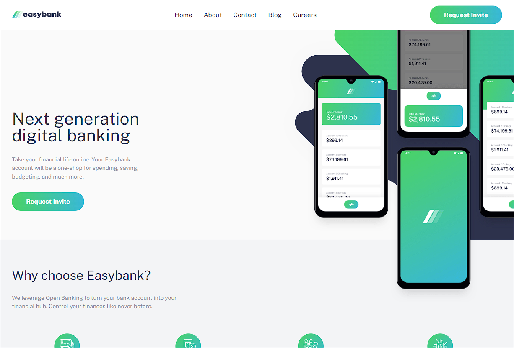
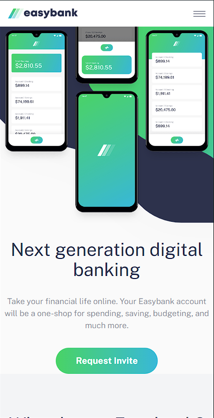

# Frontend Mentor - Easybank landing page solution

This is a solution to the [Easybank landing page challenge on Frontend Mentor](https://www.frontendmentor.io/challenges/easybank-landing-page-WaUhkoDN). Frontend Mentor challenges help you improve your coding skills by building realistic projects.

## Overview

### Screenshot




### Links

- Solution URL: [Add solution URL here]()

## My process

### Built with

- Semantic HTML5 markup
- CSS custom properties
- Flexbox
- CSS Grid
- Mobile-first workflow
- [React](https://reactjs.org/) - TS library
- [TailwindCss](https://tailwindcss.com/) - For Style
- [Vite](https://vitejs.dev/) - React framework

### What I learned

Desafio junior usando HTML, CSS e javaScript fácil

```tsx
<header className="bg-White z-20 p-4 shadow-md lg:px-8">
  <div className="mx-auto flex items-center justify-between lg:max-w-[1440px]">
    
    <Nav />
    <div className="hidden lg:block">
      <Button />
    </div>
  </div>
</header>
```

### Continued development

Especilizando-se em Reactjs e Web3

## Author

- Website - [Joelson Silva](https://joelson-portfollio.vercel.app/)
- Frontend Mentor - [@JoeSeraphy](https://www.frontendmentor.io/profile/JoeSeraphy)
